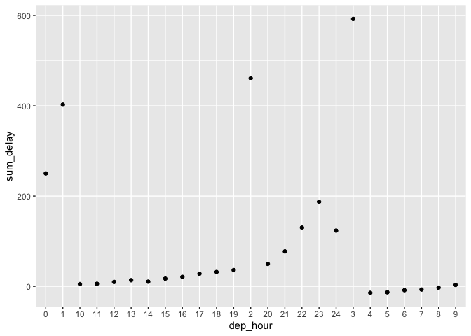
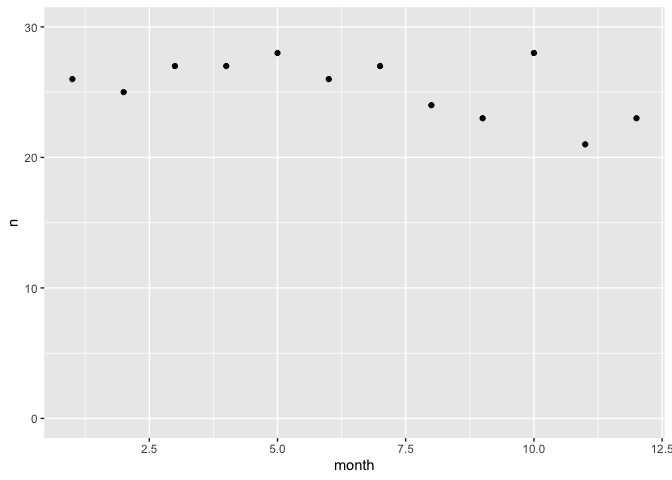
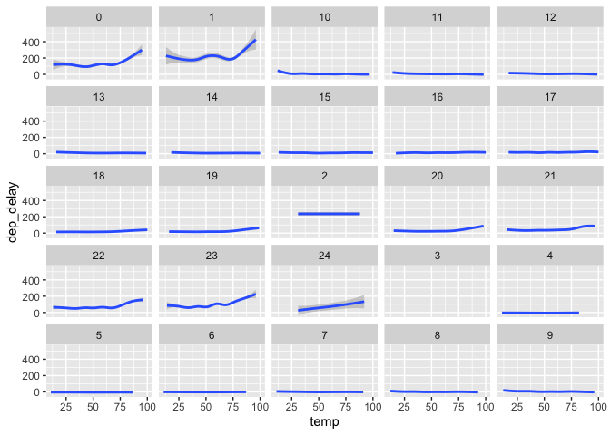

hw2
================
2022-10-11

``` r
library(dplyr)
```

    ## Warning: package 'dplyr' was built under R version 4.0.5

    ## 
    ## Attaching package: 'dplyr'

    ## The following objects are masked from 'package:stats':
    ## 
    ##     filter, lag

    ## The following objects are masked from 'package:base':
    ## 
    ##     intersect, setdiff, setequal, union

``` r
library(tidyr)
```

    ## Warning: package 'tidyr' was built under R version 4.0.5

``` r
library(ggplot2)
library(nycflights13)
library(stringr)
flights
```

    ## # A tibble: 336,776 × 19
    ##     year month   day dep_time sched_dep_time dep_delay arr_time sched_arr_time
    ##    <int> <int> <int>    <int>          <int>     <dbl>    <int>          <int>
    ##  1  2013     1     1      517            515         2      830            819
    ##  2  2013     1     1      533            529         4      850            830
    ##  3  2013     1     1      542            540         2      923            850
    ##  4  2013     1     1      544            545        -1     1004           1022
    ##  5  2013     1     1      554            600        -6      812            837
    ##  6  2013     1     1      554            558        -4      740            728
    ##  7  2013     1     1      555            600        -5      913            854
    ##  8  2013     1     1      557            600        -3      709            723
    ##  9  2013     1     1      557            600        -3      838            846
    ## 10  2013     1     1      558            600        -2      753            745
    ## # … with 336,766 more rows, and 11 more variables: arr_delay <dbl>,
    ## #   carrier <chr>, flight <int>, tailnum <chr>, origin <chr>, dest <chr>,
    ## #   air_time <dbl>, distance <dbl>, hour <dbl>, minute <dbl>, time_hour <dttm>

``` r
colnames(flights)
```

    ##  [1] "year"           "month"          "day"            "dep_time"      
    ##  [5] "sched_dep_time" "dep_delay"      "arr_time"       "sched_arr_time"
    ##  [9] "arr_delay"      "carrier"        "flight"         "tailnum"       
    ## [13] "origin"         "dest"           "air_time"       "distance"      
    ## [17] "hour"           "minute"         "time_hour"

``` r
flights["dep_time"]
```

    ## # A tibble: 336,776 × 1
    ##    dep_time
    ##       <int>
    ##  1      517
    ##  2      533
    ##  3      542
    ##  4      544
    ##  5      554
    ##  6      554
    ##  7      555
    ##  8      557
    ##  9      557
    ## 10      558
    ## # … with 336,766 more rows

``` r
add = function(df, a){
  
  
  for (x in 1:nrow(df)){
    
    
    if  (str_length(df[x, a]) == 2 ) {df[x,a] = paste0("0", df[x,a])}
    
    else if (str_length(df[x, a]) == 1 ) {df[x,a] = paste0("00", df[x,a])}
  
    
  }
  
  return(df)
}

flights$dep_time = as.character(flights$dep_time)

flights = flights %>% 
  drop_na()

flights = add(flights, 4)
```

``` r
t1 = flights %>% 
  mutate(time = dep_time) %>% 
  drop_na() %>% 
  separate(time, into = c("dep_hour", "dep_min"), sep = -2) %>% 
  group_by(dep_hour) %>% 
  summarise(mean_dep = mean(dep_delay, na.rm = T),
            mean_arr = mean(arr_delay, na.rm = T),
            sum_delay = mean_arr + mean_dep) %>% 
  arrange(sum_delay) 

ggplot(t1, aes(x = dep_hour, y = sum_delay)) +
  geom_point()
```

<!-- --> \# 4am have
the least delay time

``` r
t2 = flights %>% 
  mutate(time = dep_time) %>% 
  drop_na() %>% 
  separate(time, into = c("dep_hour", "dep_min"), sep = -2) %>% 
  filter(dep_hour == 4) %>% 
  group_by(month) %>% 
  summarise(n = n())


ggplot(t2, aes(x = month, y = n)) +
  geom_point() + 
  ylim(0, 30)
```

<!-- --> \#Does not
depend on season

``` r
flights %>% 
  mutate(time = dep_time) %>% 
  drop_na() %>% 
  separate(time, into = c("dep_hour", "dep_min"), sep = -2) %>% 
  left_join(weather) %>% 
  group_by(dep_hour) %>% 
  ggplot(aes(x= temp, y = dep_delay))+geom_smooth() + facet_wrap(~dep_hour)
```

    ## Joining, by = c("year", "month", "day", "origin", "hour", "time_hour")
    ## `geom_smooth()` using method = 'gam' and formula 'y ~ s(x, bs = "cs")'

    ## Warning: Removed 1544 rows containing non-finite values (stat_smooth).

    ## Warning: Computation failed in `stat_smooth()`:
    ## x has insufficient unique values to support 10 knots: reduce k.

<!-- --> \# In
general, dep_delay incerases when dep hour incraeses (minor pattern)

``` r
t4 = flights %>% 
  mutate(time = dep_time) %>% 
  drop_na() %>% 
  separate(time, into = c("dep_hour", "dep_min"), sep = -2) %>% 
  filter(dep_hour == 4) %>% 
  group_by(flight) %>% 
  summarise(n = n()) %>% 
  arrange(desc(n))


print(t4)
```

    ## # A tibble: 17 × 2
    ##    flight     n
    ##     <int> <int>
    ##  1   1431    85
    ##  2   1895    48
    ##  3   1117    44
    ##  4   1843    39
    ##  5   1877    24
    ##  6   1993    24
    ##  7    881     8
    ##  8   1987     8
    ##  9   1219     6
    ## 10   1030     5
    ## 11   1113     5
    ## 12   1579     3
    ## 13   1249     2
    ## 14    697     1
    ## 15    843     1
    ## 16   1099     1
    ## 17   1545     1

\#flight 1431 tend to be the flight that has the least delay
